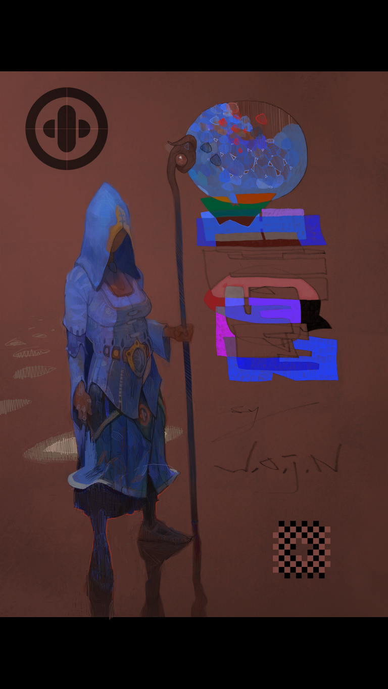

## *No comment*

### 2nd *day*
First problem looks [cool], the second one is a little bit annoying,
the third problem I haven't read yet.



*{In the first problem I'm using **/ b f s /** starting from the final position
and moving **CCW**, thus making sure all positions have solutions, if the program
doesn't find a solution within a predefined maximum queue size it dumps the last
ejected node.}*

```Python
The Clocks
Queue size: 7781

> ^ ^ [DEGH]
> > v
v > <

> ^ ^ [DEGH]
v v v
< v <

> ^ ^ [CFI]
< < v
^ < <

> ^ > [BDEFH]
< < <
^ < ^

> > > [ABC]
^ ^ ^
^ ^ ^

v v v [ABC]
^ ^ ^
^ ^ ^

< < < [ABC]
^ ^ ^
^ ^ ^

^ ^ ^ []
^ ^ ^
^ ^ ^
```

The Second problem seems like a Greedy Algoritm.


For the third problem I'm using *brute force* for *n-tuple* generation
**dynamic programming** for *permutations*, ***divide and conquer***
for *sorting* and I can guarantee you there is _N O_ way,.. y[N] way I
can solve this one in a day. Initially it looks scary because there
are no upper bounds, but actually there are, so the key was to figure
them out, I didn't mess up very much with experimenting, but here is a
solution for n = 4 number of coins with k = 1, and m = 2:

```Python
12
[[1, 7, 2, 3], [1, 3, 2, 7]]
[[1, 4, 6, 2], [1, 2, 6, 4]]
[[2, 6, 4, 3], [2, 3, 4, 6]]
```
